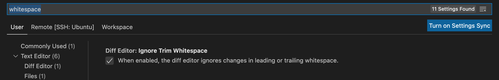
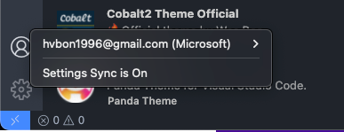

# Shortcut commands useful

Refer: https://code.visualstudio.com/docs/getstarted/tips-and-tricks

## Open settings
`Command + Shift + P`

## Close folder
`Command + k + f`

## Lock tap (keep open)
`Command + k + enter`

## Open shortcut commands setting
`Command + k + s`

## Fold and Unfold functions
Fold all:

`Command + k -> Command + 0`

Unfold all:

`Command + k -> Command + j`

## Select multiple lines
`Option + command + up/down arrow key`

## Fast split a file to right
`Control + Command + right arrow key`

# Auto clear white space

## Sync account
We should sign in account to sync vscode settings.

## Use vscode Intelli Sense to navigate code

## Navigate code

## Useful extension
### Git

### Theme

### Code debugging, navigation
Use Intelli Sense or Clangd

### Serial monitor

